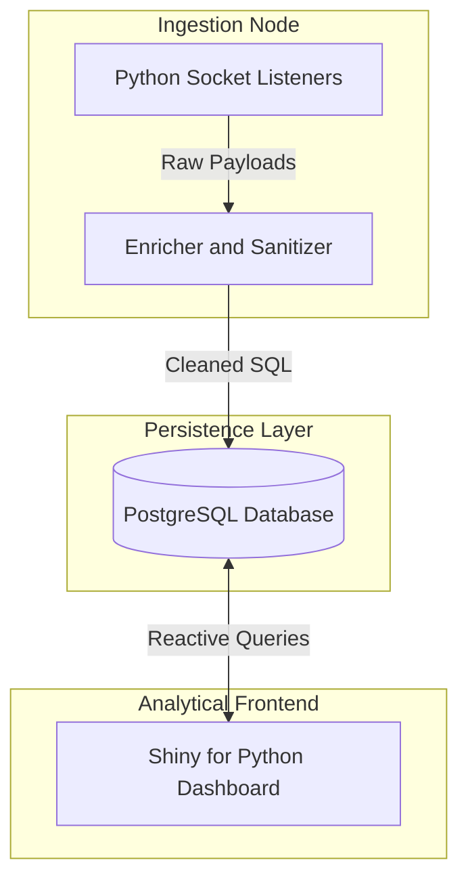
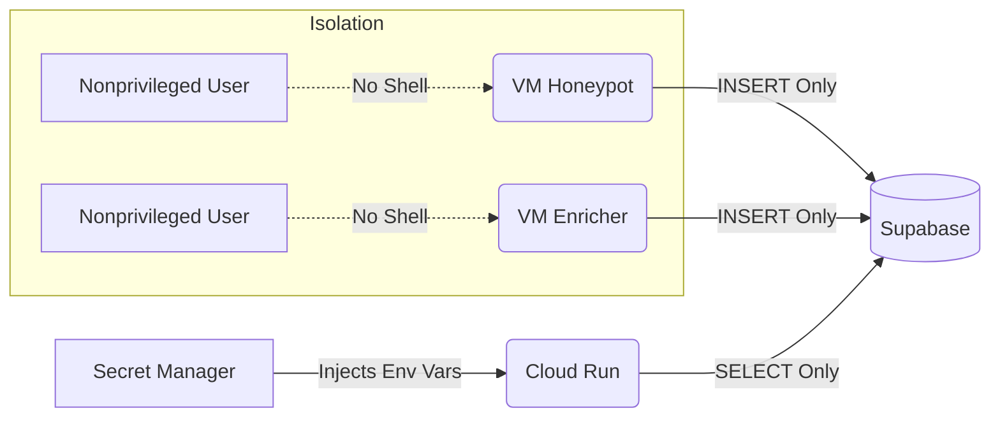

# arachne
### Distributed Threat Intelligence and Honeypot System
**Arachne** is a modular pipeline designed to capture, enrich, and visualize real-time malicious traffic. By mimicking vulnerable services on an exposed endpoint, the system captures bot traffic, enriches it with geographical metadata, and provides a live analytical dashboard for monitoring.

## Architecture
This project follows a decoupled microservice architecture, separating high traffic data ingestion from long term storage and analytical presentation.

* **Ingestion Node**: Hardened sensor running Python socket listeners designed to capture and log raw TCP payloads
* **Processing Engine**: Standalone service responsible for geo-ip resolution and data sanitization
* **Persistence Layer**: Managed PostgreSQL instance utilizing a dedicated `arachne` schema for data storage and management
* **Analytical Frontend**: Containerized Shiny for Python dashboard, deployed as a serverless microservice to provide realtime filtering, querying, and mapping

## Security and Pipeline

* **Privilege Isolation**: Host-level services operate under dedicated, non-privileged system accounts with no shell access, utilizing strict Linux ACLs to prevent undesired directory access.
* **Secret Management**: Utilizes a Zero-Trust approach; all sensitive database credentials and API keys are stored in Google Secret Manager and injected as environment variables at runtime.
* **CI/CD** (*Planned*): Integrated GitHub Actions for automated container builds and deployments to Google Cloud Run

## Technical Stack
* Languages: Python 3.12
* Database: PostgreSQL 16 (hosted on Supabase)
* Frontend: Shiny for Python
* Cloud: Google Cloud Platform (Cloud Run, Secret Manager)
* DevOps: Docker, Linux (Ubuntu), GitHub Actions

## Development Journey
This project is an iterative process of solving real world networking, database, and technical hurdles. To see the detailed journey, see **[Development Log](./DEVLOG.md)**.